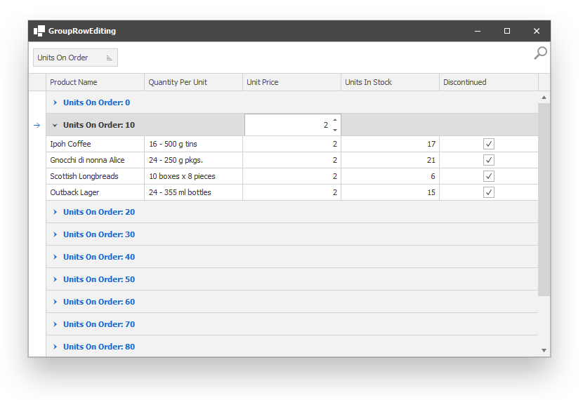

<!-- default badges list -->

[](https://supportcenter.devexpress.com/ticket/details/E3036)
[](https://docs.devexpress.com/GeneralInformation/403183)
[](#does-this-example-address-your-development-requirementsobjectives)
<!-- default badges end -->

# WinForms Data Grid - Display editors in a group row to edit cell values in the group 

This example demonstrates how to display column editors in group rows. The user can use the editor to specify the same value for all cells in a column in a group.



You can also enable the `GroupEditProvider.ShowGroupEditorOnMouseHover` option to automatically invoke the group editor on mouse hover.

```csharp
provider = new GroupEditProvider(gridView1);
provider.ShowGroupEditorOnMouseHover = true;
provider.SingleClick = true;
provider.EnableGroupEditing();
```


## Files to Review

* [GroupEditProvider.cs](./CS/WindowsApplication3/GroupEditProvider.cs) (VB: [GroupEditProvider.vb](./VB/WindowsApplication3/GroupEditProvider.vb))
* [Main.cs](./CS/WindowsApplication3/Main.cs) (VB: [Main.vb](./VB/WindowsApplication3/Main.vb))
<!-- feedback -->
## Does This Example Address Your Development Requirements/Objectives?

[](https://www.devexpress.com/support/examples/survey.xml?utm_source=github&utm_campaign=winforms-grid-enable-editing-in-group-row-to-change-cell-values&~~~was_helpful=yes) [](https://www.devexpress.com/support/examples/survey.xml?utm_source=github&utm_campaign=winforms-grid-enable-editing-in-group-row-to-change-cell-values&~~~was_helpful=no)

(you will be redirected to DevExpress.com to submit your response)
<!-- feedback end -->

